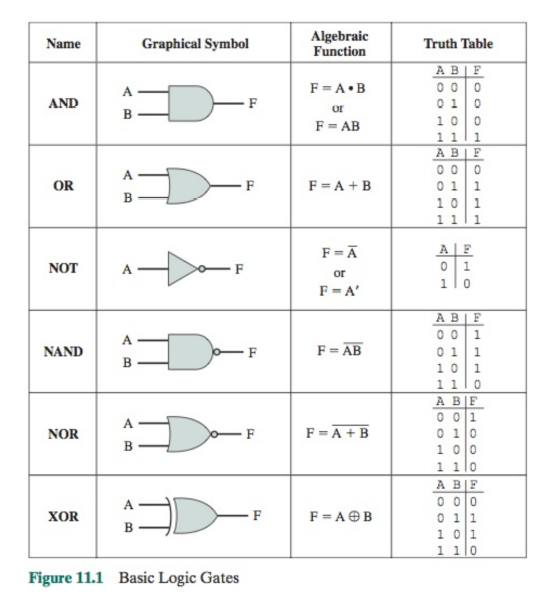
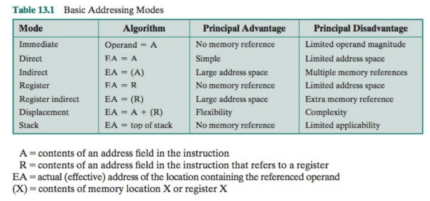

The post gives some keypoints on the course content of COMP2120 Computer Organization @HKU, 2021-22 semester 2. Since I wrote it as the cheat sheet for attending the final exam, some abbreviations for words (both technical and non-technical) were used, which might not be clear. You can also expect some strange formatting.

# COMP2120 Notes

## Evolution

Benchmarks: MIPS, MFLOPS; measure the time required to do some real jobs - SPECmarks

## Digital Logic

1. any logic expression can be written with only NAND or NOR
   - $\bar{A}\equiv A\text{ NAND } A$
   - $A.B\equiv \overline{A\text{ NAND } B}$
   - $A+B=\bar{A}\text{ NAND } \bar{B}$
2. minterm: AND of terms - exactly one 1 in its truth table
3. cpu any logic expression can be written as a sum of minterms (sum of products)




## Number & Arithmetic

1. from radix 10: find all digits by repeated dividing the quotient by $r$
   - for fractional numbers, multiply by $r$ and get the integral part
2. between radix 2, 8 and 16: group by 3 (oct) or 4 (hex) binary digit together
3. represent ingsigned numbers
   - $f(\text{bit pattern}) = \text{value}$, where value can be positive, negative, char, etc.
   - excess $2^{m-1}$
     - divide the range into two halves
     - $\text{value}=\text{bit pattern}-(2^{m-1}-1)\in[-2^{m-1}+1,2^{m-1}]$
   - one's complement
     - +N= bit pattern, -N = inverting bit pattern of +N = $(2^n-1)-N\in[-2^{n-1}+1,2^{n-1}]$
     - -N's bit pattern has MSB=1
     - problems: 2 zeros, arithmetic
   - two's complement
     - add 1 to negative bit pattern = $2^n-N\in[-2^{n-1},2^{n-1}-1]$
     - arithmetic: add together and discard any carry from the MSB
     - sign extension: add additional bit positions to the left and fill in with the value of the original sign bit
4. floating point: sign S, biased exponent E, significand M (mantissa)
   - +ve/-ve overflow/underflow
   - actual value = $(-1)^S\times1.M\times2^{E-127}$ (single precision,  bit of exponent = 8)
   - not all can be represented precisely (e.g. 0.2), different order may yield different results
   - addition: right shift M of number with smaller E, normalize the result
   - multiplication: subtract bias in exponent
5. multiplication of signed operand:
   - perform normal multiplication, except that if the partial sum is negative, need to sign-extend the number to
     become a negative double precision number. This is done except the sign bit.
   - If sign bit = 0, do nothing, else take complement of multiplicand and sign extend. Add this to the partial sum.
   - Ignore carry out during addition.
6. Adder:
   - half-adder (2 inputs, 2 outputs) full-adder (3 inputs, 2 outputs)
   - add n-bit numbers: ripple adder (slow), carry look-ahead adder, carry-save adder

## Execution

- 2 basic cpu operations: data movement, data proccessing with ALU
- an instruction is usually 32-bit (4 bytes) word
- instruction fetch: MAR $\leftarrow$ PC; IR $\leftarrow$ mem[MAR] 
- operand fetch, execute **
- interrupt

## Memory

- RAM (the only volatile of all)
  - dynamic: transistors to store charges by capacitance effect, need refreshing, slower, 1 transistor per bit, much cheaper and hence more memory
  - static: logic gates to store data (latch), faster, used in cache memory
- ROM
  - ROM/PROM: cannot change content.
  - EPROM: content of entire chip can be erased by UV lights.
  - EEPROM: can be erased by using electric current (but slow)
- Flash memory
  - faster than EEPROM in writing, used in handheld device/mobile phones
  - storing BIOS of PC, used as SSD, limited number of write cycles
- performance: access time, memory cycle time, transfer rate; throughput
- memory byte ordering: big Endian (left-to-right) / little for multiple byte data
- error detection: a single parity bit, chosen such that #1 in the bit pattern (inc itself) is even (even parity)
- principle of locality: memory reference tends to be localized (e.g. code, small arrays, blocks of local variables in a subprogram)

## Cache

1. mapping: 32-bit address [block id] [cache set no.] [offset in block]
2. e.g. 128kb cache memory, 2-way set associative, cache line (block) size = 64b
   - no. cache lines = 2048, no. sets = 1024
   - given address 346b2a70 (16, 10, 6 bits), set number = 10 bits = 169
   - matching id = 16 bits to match against the 2 tags in set number 169
3. direct-map organization (1 cache line)
   - pro: no need to perform selection (requires logic, logic gates need time to run), so faster
   - con: multiple memory blocks mapped to the same cache set, maybe needed by the running program at the same time (i.e. code and data) hence result in many cache misses
4. k-way set associative: need to compare the tags of cache lines with the block-id of the address
5. replacement: FIFO, LRU
6. write: need to maintain data consistency between cache and main memory
   - write through: when writing cache, also write main memory
     - difficult to manage when need to access memory (e.g. cache miss) if the previous write has not finished yet
   - write back: write back only when it is replaced
     - inconsistent $\to$ difficult to manage when need I/O operation
7. unified cache: memory contention problem on parallel and pipeline execution of instructions
8. e.g. 512 words cache, 2-way, block size = 64, LRU, cache hit time = 10ns, 4 words in parallel, burst mode: first 4 words 60ns, subsequent 4 words 12ns, each block 24 references on avg
   - miss penalty = 60 + 15 * 12 = 240ns; no. blocks = 8; no. sets = 4
   - 0 1 2 5 3 2 5 3 11 7 9 0 6 0 7 9 8 7 9 11 12 2 4 5 12 15 12 13 15
   - final content: `[[12,4],[13,5],[2,6],[15,11]]` total cache misses = 14
   - no. blocks accessed = 29; no. memory access = 29 x 24 = 696
   - cache hit rate = 1 - 14/696 = 97.88% avg access time = 14.8ns

## External

1. magnetic disks
   - platters, which have circular tracks, which have sectors
   - synch byte (id, data), information, crc (error detection)
   - all the r/w head moves together; tracks of different platter under the head -> cylinder
   - access time: (a) seek: move head from one cylinder to another (b) rotational delay: avg latency = half a revolution (c) data transfer time << seek + latency
2. RAID: redundant array disks, appeared as a single hard disk to the system, allow parallel op
   1. efficient for block, nonredundant `[[0,4,8],[1,5,9],[2,6,10],[3,7,11]]`
   2. duplicate (mirrored), fault tolerant, either copy can be used during reading, hence reduced seek time
   3. hamming code in extra HDDs, expensive
   4. extra HDD contains parity bit, easily reconstruct the content of one failed HDD
   5. block level parity
   6. block level distributed parity, commonly used in NAS
   7. level 5 with 2 parity strips calculated using different method

3. solid state drives: limited number of write cycles; advantages:
   - high-performance i/o, durability - less susceptible to physical shock and libration
   - longer lifespan and lower power consumption since no mechanical 
   - quieter and cooler operation; lower access time

## I/O

1. asynchronous communication as large speed variation
2. cpu controls the operation of the io devices by w/r the data and status/control registers
3. dedicated io ports if io instructions provided in cpu / more often in memory map
4. programmed io: cpu->io, io->cpu repeatedly until, io->cpu, cpu->memory
5. interrupt-driven io: issue command, continue, io interrupt when it finishes, suspend, execute, return
   - interrupt: put PC, flag registers and other registers used into the stack (in memory); restore with return
6. dma: minimize cpu intervention with intelligent device controller (io processor)
   - when cpu and io processor want to write to memory at the same time
   - steal cycles: io issues signal to tell cpu to disconnect from buses, which io then controls
   - cpu will see an elongated clock, in which io r/w the memory
   - when finishes, remove the signal and the clock returns to normal
   - note that it causes cpu to execute at a slower rate; io notifies cpu by the end of an entire io operation

## Instruction



```assembly
XOR R1,R1,R1 ;init R1 to 0
MOV #A,R2 ;R2=addr of array A
MOV #1024,R3 ;R3=size of array
LOOP: ADD R1,(R2),R1 ;R1=R1+(R2)
ADD R2,#4,R2 ;incr R2 to next elt
SUB R3,#1,R3 ;decrement R3
BNE LOOP ;if result!=0 branch
```

```assembly
XOR R2,R2,R2 ; init R2=0
MOV #1024, R3 ; init R3=size
LOOP: MOV A(R2), R4 ; A=start addr of A[]
MOV B(R2), R5 ; B=start addr of B[]
OR R4, R5, R6
MOV R6, A(R2)
ADD R2,#4,R2 ; increase R2
SUB R3,#1,R3
BNE LOOP
```

## ALP

```assembly
.data
a: .asciiz "This is a test"
# zero-terminated string
.text
main: sub r9,r9,r9 # r9=0
loop: lb a(r9),r10 # load byte
beq r10,#0,exit # r10==0? end of string
call capitalize # call capitalize
sb r10, a(r9) # store result back
add r9,1,r9 # incr r9, next char
br loop # goto loop
exit: ret # return
Capitalize:
push r8; push r9
ld #0x61,r8 #r8=’a’
ld #0x7a,r9 #r9=’z’
blt r10,r8,ret1; bgt r10,r9,ret1
sub r10,#0x20,r10 #0x20=’a’-’A’
ret1: pop r9; pop r8; ret 
```

## OS

1. os is a software that controls the execution of programs on a processor and manages the processor’s resources.
2. user interface: cmi, program execution, file manipulation
3. interface to programs: os calls (special instructions) e.g. file open/close, r/w
4. services provided by os: program creation & execution, io access, file system management, system access, error detection and response, accounting
5. protection scheme: user & kernel mode; system has to change to kernel mode to run/use the protected resources. OS functions accessed via system calls (special entry points)
6. cpu multitasking e.g. perform io, stop execution, next; queue of processes (many factors)
7. mapping from logical addresses of programs to physical addresses of memory, done by MMU
8. paging: logical & physical -> pages, each process own logical ~ and page table (map)
   - each pte contains v(in memory or not), p(protection mode), d(if page been changed)
   - table cached in tlb; MMU performs address translation & protection checking (e.g. fetch required page from hard disk to memory and restart program)
   - when program starts, nothing in memory -> many page faults at start until a stable working set, use prepaging to bring in some pages at start
   - address translation: (a) extract logical page no. (most sig n-bits); (b) find corre pte and see if page is in physical memory; (c) yes then get frame no. & append offset; no then page fault
   - fault handling: (a) page from hard disk (b) find a free page in physical / replace (c) if dirty then write back (d) invalid that pte (e) write the page to that physical page (f) modify its pte
9. cache + vm: address translation via tlb, the cache of page table
   - if pte not in tlb, then use the page table and put it into tlb
   - obtain the physical address; use it to access cache memory; cache miss handling

## Processor

1. to generate control signals
   - hardwired*: logic gates designed with truth table, faster, simpler instruction set
   - microprogrammed: signals and truth table stored in memory, simple design, easy to modify

2. 3 stages instruction execution cycle:
   - fetch instruction
   - decode instruction
   - instruction execution: calculate operand addresses*
     - fetch operands from registers/memory; execute instruction*; write operand
     - *can be combined as ld/st do not need to "execute"
   - e.g. ADD A, B, C absolute addressing -> 4 words, read next word to get address

3. pipeline: increase the throughput

   - branch/interrupt -> update pc and empty pipe
   - no CO stage -> 5-stage pipeline
   - resources required by each stages should not overlap, otherwise duplicate resources needed: e.g. 
     - dedicated incrementer for PC instead of using ALU; multiple internal buses
     - separate read port for data and instruction, or separate instruction and data cache
   - for an ideal pipeline, each instruction 5 stages 5 clock cycles, throughput = 1 instruction/clock cycle

4. pipeline hazards: situations that prevent the next instruction from entering pipeline

   - resource hazard: conflict, e.g. PC inc and ALU operation; two multiply
   - data hazard: data dependency on the result of previous instructions
     - re-arrange if possible: insert instructions in between; data forwarding
     - only RAW types occur in a pipeline; others occur in parallel systems
   - control hazard: branch, call, etc. don't know where to continue until it finishes
     - branch prediction: continue execution only 1 of 2 paths, correct prob = 50%
     - can always write back to register/memory if wrong; higher prob for for-loop
     - dynamic branch prediction: change decision when 2 consecutive wrong predictions

5. performance: execution time = instruction cnt x cpi x clock cycle time

   - more effective pipelining -> higher throughput -> smaller cpi
   - multiple instruction execution unit; large register file -> reduce memory access ->higher speed
   - simplified instruction set -> reduce the need for microprograms, which is slower than hardware

6. modern processors: register-register except ld and st; 

   - fixed length and simple, fixed format instructions; 

   - few operations and addressing modes, simple cpu -> simple implementation -> faster clock rate, more efficient pipeline as less cases to consider

   - hardwired instead of microprog control; eliminate effect of pipeline hazards with soft & hardwares

   - rely on optimizing compiler to enhance system performance, e.g. register allocation

