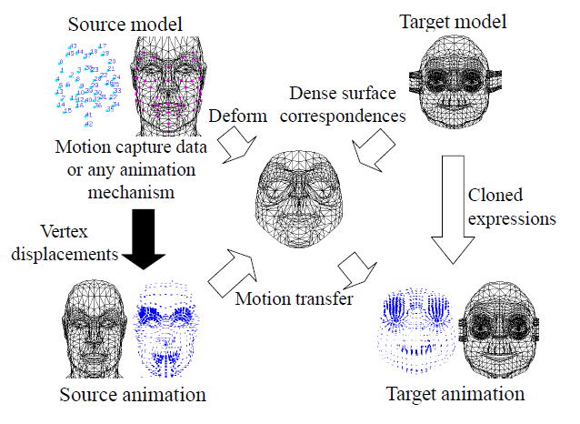

The post gives some keypoints on the course content of COMP3360 Computer Animation @HKU, 2021-22 semester 2. Since I wrote it as the cheat sheet for attending the final exam, some abbreviations for words (both technical and non-technical) were used, which might not be clear. You can also expect some strange formatting.

Due to the limited time for exam preparation, I did not include the part on implicit integration and the second part of data-driven facial animation. I may (or may not) add them in the future as a separate note and attach the url here.

# COMP3360 Notes

## Basics of Computer Animation

1. joints (translational - 1,2,3; hinge - knee, 1; universal - wrist, 2; rotational - shoulder, hip, neck)
   - 2 ways to represent 3D rotations: gimbal (3 motors, euler angle) & free joint
   - gimbal lock: e.g. order = x-y-z, rotate y for 90 deg, same x & z axis, 1 dof lost
   - free: ball joint, rotation by angle $\alpha$ around axis a $(a_xS\frac{\alpha}{2},a_yS\frac{\alpha}{2},a_zS\frac{\alpha}{2},C\frac{\alpha}{2})$
2. generalized coordinates = (root location, root orientation, joint angles)
3. homo coord trans: 4d matrix, LHS mul $\to$ world space, RHS $\to$ local space
4. f kinematics: joint angles $\to$ position and orientation (of the end effector); ik
5. interpolation: linear; high-order polynomial e.g. bezier - 2 end points, 2 control points for tangent vector
   - slerp for quaternions, $\theta=\arccos(q_1\cdot q_2), c_1=\frac{\sin\theta(1-t)}{\sin\theta}, c_2=\frac{\sin\theta t}{\sin\theta}$
   - problems: constraints may not satisfied, error-propagation
6. solution: ik - 3 approaches: analytical,
   - cyclic-coord descent: move up the hierarchy and move the next joint to min the distance between the end effector and the target; repeat until the ee reaches the target or max iterations reached (in case unreachable target) *may have oscillation problems*
   - pseudo-inverse: *any topo structure, multiple constraints, incorporate physics*
     - for small movements, linear $\Delta e=J\Delta q$
     - pseudo inverse $J^+=(J^TJ)^{-1}J^T,\ \Delta q=J^+\Delta e$ (derived from lagrange multiplier)
     - iteratively update the generalized coord so that position constraints are satisfied
     - singularity problem: unreachable posture when all the joints are fully extended, then the system becomes unstable. solution:
   - damped least squares: $J^+=J^T(JJ^T+k^2I)^{-1}$ by imposing soft constraints

## Motion Capture & Physically-Based Character Animation

1. motion capture
   - optical: reflective markers, 3D location computed by stereo vision; manually labelled first, tag again when occlusion, less intrusive, very accurate, capture motion + skin movement
     - joint center prediction: define coord system for each bone using markers, compute the trans matrix, $M_1v_1-M_2v_2=0$, solve with least squares
   - magnetic: location given by amplitude, no occlusion, no manual post-processing, less accurate (positios highly distorted, noise, no ~ devices), only 2-3m away
   - inertial: measure $\Delta\omega$ (gyro sesnor) and $\Delta a$ to compute orientation and position, unlimited range, rapid accumulating errors, solution: periodically reset
   - mechanical: need to additionally detect root location; video-based
2. physical: force (ma, coriolis, gravity) to body and torque to joints
   - f dynamics: input = force, output = a$\to$v, x (fall); id (punch)
   - pd control: $-F=a(q-q_d)+c(q'+q'_d)$ for torque then switch (dance)

## Forward / Inverse Dynamics

1. articulated bodies: force between joints, torque generated by motors at joints
2. equation of motion $\tau=H\ddot{q}+C(q,\dot{q})+\tau_g$
3. id: newton-euler - O(n), compute v, a from root to leaf with $q,\dot{q},\ddot{q}$, 
   - eq of m $f_i^a=r\times F_{ext}+\tau=I\dot{\omega}+\omega\times I\omega$ with $\omega:=v$
   - compute joint forces from leaf to root $f_{i+1}=f_i^a-f_i^{ext}+\sum_{j\in c(i)}f_j$
4. fd: recursive n-e - O(n3), use id solver to compute $C(q,\dot{q})+\tau_g$ then H
5. fd: articulated body inertia - O(n), compute $I^A,P$ from leaf to root, then $\ddot{q},a$ from root to leaves

## Motion Synthesis by Optimization / Editing

1. optimization problems: high dimensionality, local extrema
2. fd: hard to find good initial motion, need to keep balance; id: need good objective function
3. motion warping (small, avoid obstacles): add offset to satisfy constraints, insert a keyframe
4. motion editing by ik: ee trajectory, $\dot{q}=J^+\dot{x}+(I-J^+J)y$, null space term -> redundant dof & to do secondary tasks
5. motion blending: to synchronize motions, dtw - similarity matrix by diff of postures, find shortest path from lb to rt; can also be used to search similar motion clips
6. motion style editing: fourier analysis on 2 motions then interpolate

## Learning Human Motion

1. map between control signal to entire pose: radial basis fs, find coefficients given data pairs
   - gaussian processes for better interpolation in the middle
   - solve linear system/optimize hyperparameters with knn is costly
2. matching: need to carefully select search feature, no learning happens
3. dl: learn prior of motion data with temporal conv AE, temporal invariance
4. ambiguity: e.g. foot contact, auto label with foot speed & height, use small nn to map trajectories to contact durations and freq
5. motion editing: csp over hidden units
6. whole process: disambiguation $\to$ motion synthesis $\to$ motion editing

## Learning RT Controllers from MoCap

1. classic: finite state machine, motion graphs $\to$ manual works, all motions in memory
2. matching: search online, no pre-comp, still slower with large database $\to$ get stuck
3. lstms: good control signal and architecture to avoid ambiguity in the future, motion smoothed out with avg poses, response to inputs can be slow
4. phase-functioned nn: additional inputs for trajectory $\to$ remove ambiguity, produce transitions between diff styles

## Physics-based Animation

1. $v=\dot{x}+\omega\times r$, $L=\sum_i m_ir_i\times(\omega\times r_i)=I\omega$, dL/dt=torque, $I=\sum mr^*r^{*T}=RI_0R$
2. cons of mass-spring: depends on the set-up of the spring network, spring constants difficult to tune, volumetric effects cannot be captured directly (vol conservation, prevention of vol inversions)
3. hyperelastic: independence of the strain energy on the prior deformation history.\
4. deformation gradient F (Jacobian of $\phi$) $\to$ express strain energy, first PK stress tensor, ...
5. constitutive model: math description of physical traits, eqs relate stimuli (deform) to material response (force stress)
6. isotropic: resistance to deform same along all orientations $\iff \Psi(FQ)=\Psi(F)$
7. rotational invariance $\iff \Psi(RF)=\Psi(F)$
8. SVD$\to\Psi({F})=\Psi({U}{\Sigma}{V}^T)=\Psi({\Sigma})$ contains 3 singular values, write invariants in terms of them
9. pros with $I$s: more intuitive about flavor and severity, assume rot inv, easy to compute derivatives, no tendency to collapse
10. cons: SVD, chain rule to compute P from $\Psi$, derivatives non-linear/inverse mat cal $\to$ costly
11. linear elasticity, St. Venant-Kirchhoff model, corotated linear elasticity, isotropic materials and invariants, and neohookean elasticity.
12. TODO: implicit integration

## Crowd Simulation

1. flocking: separation, alignment, cohesion, avoidance, with simple rules
2. behavior model, a hand-tuned controller (grow if) + modules to synthesize behaviors $\uparrow$
3. patch (shape+motion)-based, associate motions with objects, create scenes by building blocks
4. pros: efficient data handling, decentralized $\implies$ scalable, crowd patches
5. velocity obstacle; rvo: avg of v outside vo and current v - no oscillation, no globa comm needed between agents, can handle multiple agents (cal all rvo)
6. continuum crowds: solve both path-plan and coll-avoid
   - compute potential field (given other avatars, obstacles and the goal), determine movement, update field
   - group by the inputs, efficient if few groups
7. supervised learning: track crowd behaviors in video with cv techniques $\to$ s-a pairs
   - state: vel, neighbor~ formation (temporal?), intention (from avg motion), pivots
8. probabilistic model: find clusters of diff behaviors in neighbor~, regression within a sel cluster (s.t. motion does not switch often)
9. high-level: first fsm then model; follow trajectory: blend motion in diff curvatures

## Skinning

1. linear blend skinning: a vertex belongs to multiple bones $v=\sum_i w_iM_i'M_i^{-1}v_g$
2. dual quaternions used to blend rigid trans, without volume loss at extreme joint angles
3. rot: $q=C\frac{\theta}{2}+nS\frac{\theta}{2}, v'=qvq^*$; dual: $\hat{a}=a_0+\epsilon a_{\epsilon}$ with $\epsilon^2=0$
4. a0 rot; ae trans: $1+\frac{\epsilon}{2}(ai+bj+ck)$; coord: $1+\epsilon(v_0i+v_1j+v_2k)$
5. matrix for each bone by fk, convert to dual, normalize, cal global pos $\hat{q}\hat{v}\bar{\hat{q}^*}$
6. anatomical: muscles contract when joints bent, dist decreases, vol pump up, skin deformed
7. data-driven: template model + body shape + pose offsets
8. body = 21,000D point $\to$ subtract mean and do pca
9. rest pose v T 3N, joint loc J 3K, blend weights W NxK, pose params $\theta$ 3K; offset to rest pose then LBS 
10. smpl: $T(\theta)=T+B_p(\theta),B_p(\theta)=\sum_i f_i(\theta)P_i$ , Pi = vec of displacements in actual poses 
11. $f(\theta)$ linear in rot mat but non-linear in pose; $M(\theta,\beta;T,S,P,W,J)$ 
12. trained to min surface reconst error

## Facial Animation

1. geometry and texture data, fit a generic face mesh into the range data using feature points
2. skin, fat, muscles: mass-spring, need to preserve volume - push node upwards
3. animation: with anatomical model, muscles activated to overlap markers
4. cons of musculoskeletal model: quality depends on model (muscle details, soft materials, muscle activation); below: expression cloning, cal corr with RBF
5. amend motion vectors: rot adjusted by diff of normal vectors between src and tgt; mag scaled by local size variation
6. deformation transfer: mesh-based, can do non-rigid deform; first cal deform for every src triangle, then cal mapping from src to tgt, apply deform to tgt triangles
7. this leads to holes in result mesh as too many dof; solve by preserve consistency: $\min\sum_j \norm{S_{s_j}-T_{t_j}}^2$
8. photometric cap: find 3D location with stereo vision, normal vectors added as details
9. blendshapes: face ik - $\min\sum(c_f-c'_f)^2$ subject to $\sum c_fs_{l,f}=p_l$ and $\sum c_f$=1
10. impossible hard constraints $\to$ unstable results; sol: change $p_l$ to soft and min diff
11. local control to create more, e.g. asymmetric expressions not from symmetric
12. digital emily: take img under diff lighting, create reflectance model $\to$ polarization, reconstruct 3D geometry, produce facial rig, create animation
13. diffuse (directional, no dep on cam angle) $I_pk_d\cos\theta$+ specular (highlights, no dep on color) $I_pk_s(\cos\alpha)^n$ reflection
14. parallel polarizer passes specular + part diffuse; cross passes part diffuse
