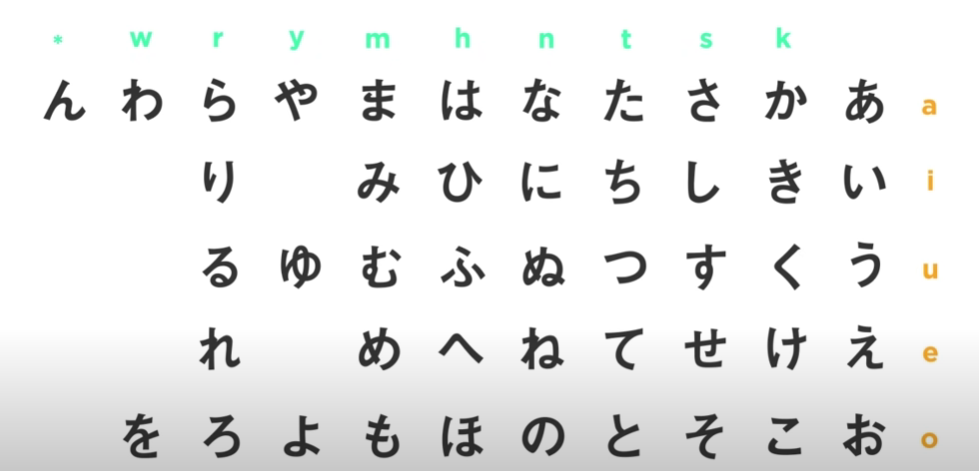

This is where I take notes when learning Japanese. Sources are acknowledged in the beginning.

Source: YouTube, [JapanesePod101.com](https://www.youtube.com/watch?v=8YV8KmfBbBM)

## Day 1

- Japanese is a 'mora-timed' language; syllables are pronounced equally.
- Japanese characters can represent a vowel, a consonant and a vowel or a single consonant sound.
- Word order: subject, object, verb, or SOV
- topic-prominent language
  - topic is the focus; usually omits the subject
  - create basic sentences; object + verb
- 3 different scripts used to write Japanese
  - Hiragana ひらがな is used to write functional words and particles.
  - Katakana カタカナ is used to write foreign words and names.
  - Kanji 漢字 is used to write native Japanese words, or words of Chinese origin.

## Day 2

> Note: for writing Japanese on a PC, you can download Google Japanese IME, which can be more convenient than the Windows native IME. You can shift between Japanese and English with `Alt` + `~`.

**ありがとう** arigato1 - thank you

**すみません** sumimasen - I'm sorry/excuse me

**どこですか** - where is ...? Put place name before the phrase, e.g. 駅はどこですか？ホテルはどこですか？コンビニどこですか？

> Why is は (ha) sometimes read as わ (wa)? 
>
> は is only pronounced as wa when being used as topic marking particle or the end of a phrase, e.g. こんばんは (good evening), こんにちは (hello). But for instance, はる (春) is pronounced as haru.

The timing of each syllable is important. Syllables pronouncing with different time can have different meanings, e.g. おばあさん (grandma) and おばさん (aunt). To achieve the necessary pause, use a pause (つ) between syllables, e.g. きつて (stamp) and きて (please come).

Pitch accent (intonation) can also lead to words with different meanings, e.g. は2し1 (chopsticks) and 橋 (ha1shi2, bridge).
